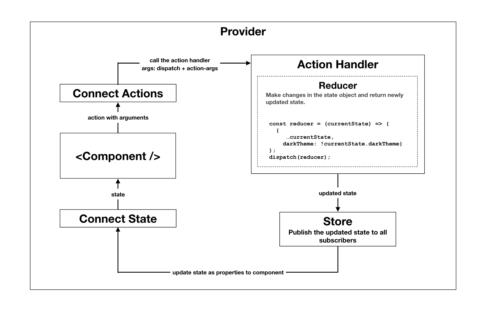

# Duxact: React + Redux with Actions as the Reducers

Application state management for [React](https://reactjs.org/) inspired by the [Redux](https://redux.js.org) & [React-Redux](https://react-redux.js.org).



> [React-Redux](https://react-redux.js.org) is one of the great ways of managing application state, it has served thousands of applications across the globe and has worked wonders in my projects as well. It all started as a personal experiment on thinking about, how can the boiler plate be reduced or almost removed? Can the switch cases in the reduers be removed? Can reducer definitions be made more simple or are they even needed? If the actions are responsible for state changes then why not the same actions be responsible to do the work which reducers do? etc. I started experimenting on the implementation of these by looking at the [Redux](https://redux.js.org) & [React-Redux](https://react-redux.js.org) code. Finally I could come up with a solution, [duxact](https://github.com/vivekmunde/duxact).

`duxact` has adopted the [Redux principles](https://redux.js.org/understanding/thinking-in-redux/three-principles) and `duxact` is based on its main conecpt **Action is the Reducer**. And with that, there is no need to define the Reducers separately and then combine them into one, which completely removes the need of Switch Cases in the Reducers.

## Installation

```
npm install --save duxact
```

## Compatibility
| React Version | Duxact Compatibility |
|--|--|
| React@16 | ^2.0.0 |
| React@15 | ^1.0.0 |

## Usage

### Defining the Store (centralized state, a single source of truth)

Store holds & provides the centralised application `state`. Use `createStore` to create the store which is to be supplied to the state provider. `createStore` can be supplied with the initial state of the application.

In the example below the `createStore` method accepts the initial state and creates the `store`.

```
import { createStore, Provider } from 'duxact';

const store = createStore({ initial: 'state' });
```

### Providing the Store to the application

Provider makes the `store` available for all the child components, by holding the store in the context. It's best to define the `<Provider/>` component at the top most level of the application hierarchy, so that the `store` is available for all of the application components responsible for managing the application `state`.

In the example below the `<Provider/>` is created at the top most level in the components hierarchy and supplied the `store`.

```
import { createStore, Provider } from 'duxact';

const store = createStore({ initial: 'state' });

const APP = () => (
  <Provider store={store}>
  ...
  </Provider>
);
```

### Consuming the State

The components can access the `state` by connecting to the `store`. This connection is done by subscribing to the `state`. To subscribe to the state and its changes, a combination of higher order component `connect` & state-to-props mapping (also called as selector) is used. Let's name this mapping function as `mapStateToProps`. The function `mapStateToProps` receives the complete application `state` object and should return **only the required state** (which the consuming/subscribing component is expected to receive) from the complete application state object. So the function `mapStateToProps` is nothing but a selector of state which selects only the needed data from state and passes it as props to the component. `mapStateToProps` is called every time there is a change in the application `state`. The function `mapStateToProps` receives the latest state. 

`duxact` uses **deep comparision** to detect changes in the selected state and it triggers rerendering only if the selected state has changed. This mechanism is explained in detail in the later part of documentation titled as `Deep comparision`.

The higher order components `connect` or `connectState` are used to subscribe for the `state` changes, as props to the component by using the `mapStateToProps` mapping. `connect` or `connectState` accepts `mapStateToProps` as an argument.

In the example below the component `DarkThemeView` needs to know if the dark theme mode is ON/OFF. The `mapStateToProps` function gets the `darkTheme` value from the current application state and returns only the needed state i.e. `darkTheme` value in the form of props to the `DarkThemeView` component. The component `DarkThemeView` receives a prop named `darkTheme` holding the current value. `connect` accepts the `mapStateToProps` as an argument and returns a function which is expecting the component `DarkThemeView` as the argument.

```
import { connect } from 'duxact';
  
// Map the state as props to the component
// An object mapping the current value of darkTheme is returned
const mapStateToProps = (currentState) => ({
  darkTheme: currentState.darkTheme
});

// This object return from mapStateToProps is mapped as props & supplied to the component
// darkTheme is received as a property
const DarkThemeLabel = ({ darkTheme }) => (
  <label>
    Dark theme is {darkTheme? 'ON' : 'OFF'}
  </label>
);
  
// connect the state to component
const DarkThemeView = connect(mapStateToProps)(DarkThemeLabel);
```

### Updating the application state by Dispatching Actions

`Actions` are responsible for changing the application `state`. Actions are nothing but pure functions, which can be called by the Components on user actions, like enable/disable dark theme by clicking on a toggle button.

The higher order component `connect` or `connectDispatch` is used along with the the actions-to-props mapping function to supply the `actions` as props to the component. Let's name this mapping function as `mapDispatchToProps`. `mapDispatchToProps` receives an argument `dispatch`. This `dispatch` function, when called, instructs the `store` to update the `state`. The `dispatch` function expects a function as its only argument. Let's call this function as the `reducer`. The `reducer` is nothing but the state updater. The `reducer` receives the current `state` and must return the updated `state`. So when the `dispatch` is called with the `reducer` as an argument then to get the updated `state` the store executes the `reducer` function, by supplying the current state to the `reducer`, then it stores the changed `state` in the `store` and publishes the updated `state` (complete `state` object) to all the components who have subscribed for the `state` changes.

`Actions` can be called with any arguments, which are needed to update the state. Like, `updateUserDetails` action can be called with user data. This user data then can be updated in the application `state`.

The higher order components `connect` or `connectDispatch` are used to supply the `actions` as props to the component by accepting the `mapDispatchToProps` mapping function as its argument.

In the example below, component `ToggleButton` expects a function named `toggleTheme` to be supplied as a property, which will be called to toggle the dark theme mode. `mapDispatchToProps` receives `dispatch` and returns an object holding the function `toggleTheme` which acts as the `action`. The action `toggleTheme` calls the `dispatch` function with a function as an argument which is called as `reducer`. The `reducer` receives the current `state` and returns the updated `state`. This returned updated `state` is merged in the application `state` by the `store`. The changed `state` is supplied to the subscriber components, like the `DarkThemeLabel` defined in the example above, in the **Consuming the State** section.

```
import { connect } from 'duxact';

// Map the actions as props to the component
const mapDispatchToProps = dispatch => ({
  toggleTheme: () => {
    // Reducer receives the current state and returns the updated state
    const reducer = (currentState) => ({
      darkTheme: !currentState.darkTheme
    });

    // The dispatch is called with a function which acts as the reducer
    dispatch(reducer);
  }
});

// Button receives the action toggleTheme
const ToggleButton = ({ toggleTheme }) => (
  <button
    onClick={() => {toggleTheme()}}
  >
    Toggle
  </button>
);
  
// connect the actions with store
const ThemeToggler = connect(null, mapDispatchToProps)(ToggleButton);
```

#API

## `connect`

`connect` is used to consume the state and dispatch the actions to update the state.

##### Arguments
1. `mapStateToProps`: (optional) A mapping function or a selector function, which receives the application state and should return the state (filtered out of the application state) required by the component. The state returned by the mapping function or selector is passed as props to the component.
2. `mapDispatchToProps`: (optional) A function which receives the `dispatch` function to dispatch the actions. This function should return an object of actions, actions responsible for updating the application state. These actions are nothing but functions which are passed as props to the component.


```
import { connect } from 'duxact';
  
// Map the state as props to the component
// An object mapping the current value of darkTheme is returned
const mapStateToProps = (currentState) => ({
  darkTheme: currentState.darkTheme
});

// Map the actions as props to the component
const mapDispatchToProps = dispatch => ({
  toggleTheme: () => {
    // Reducer receives the current state and returns the updated state
    const reducer = (currentState) => ({
      darkTheme: !currentState.darkTheme
    });

    // The dispatch is called with a function which acts as the reducer
    dispatch(reducer);
  }
});

// Button receives the state `darkTheme` and the action `toggleTheme`
const ToggleButton = ({ darkTheme, toggleTheme }) => (
  <button
    onClick={() => {toggleTheme()}}
  >
    {darkTheme? 'Apply light theme' : 'Apply dark theme'}
  </button>
);
  
// connect the actions with store
const ThemeToggler = connect(mapStateToProps, mapDispatchToProps)(ToggleButton);

```

#### `connectState`

`connectState` can be used instead of `connect` when a component only needs to consume the state and does not need to dispatch any actions.

```
import { connectState } from 'duxact';
...
const DarkThemeView = connectState(mapStateToProps)(DarkThemeLabel);
```

#### `connectDispatch`

`connectDispatch` can be used instead of `connect` when a component only needs to dispatch actions and does not need to consume the state.

```
import { connectDispatch } from 'duxact';
...
const ThemeToggler = connectDispatch(mapDispatchToProps)(ToggleButton);
```

## Deep comparison

`duxact` deep compares the changed state and old state, state derived from the `mapStateToProps` selector. It updates the consumer only if new state (derived from the mapStateToProps) has changed with respect to the old state. This avoids unnecessary re-renders of the consumer components.

In below example, component `UserDetails` will receive fresh props, `name` & `address`, only if `name` and/or `address` of the `loggedInUser` object gets updated in store. Because the mapStateToProps (selector) returns only the `name` & `address` fields of `loggedInUser`. So even if other data like `dateOfBirth`, `age` etc of the `loggedInUser` are changed, the consumer component `UserDetails` do not receive freshly mapped `name` & `address`, to avoid re-rendering of `UserDetails`.
> Please note, if any parent component in the hierarchy of the `UserDetails` has re-rendered then `UserDetails` will also re-render. Its a default behavior of react components. To avoid this use [PureComponent](https://reactjs.org/docs/react-api.html#reactpurecomponent) or [shouldComponentUpdate](https://reactjs.org/docs/react-component.html#shouldcomponentupdate).
```
import { connect } from 'duxact';
  
const mapStateToProps = (currentState) => ({
  name: currentState.loggedInUser.name,
  address: currentState.loggedInUser.address
});

const UserDetails = ({ name, address }) => (
  <div>
    <label>{name}</label>
    <label>{address}</label>
  </div>
);
  
// connect the state to component
const UserDetailsView = connect(mapStateToProps)(UserDetails);
```

## Helpers

### arrayToMapStateToProps

`arrayToMapStateToProps` is a shorthand style for defining the state mapping. All the string values provided in an array to `arrayToMapStateToProps` are supplied to the component as props.
Best suitable when the state values are to be supplied to component with same names. i.e. in the example below the `darkTheme` from the `state` is supplied to the component as property with name `darkTheme`.

```
const mapStateToProps = arrayToMapStateToProps(['darkTheme']);
```
same as
```
const mapStateToProps = (currentState) => ({
  darkTheme: currentState.darkTheme
});
```

### injectDispatch

`injectDispatch` injects the `dispatch` function as a first argument in the actions.  This enables loose coupling of the actions with `mapDispatchToProps`. The actions can be defined in a separate file.

```
// toggle-theme-action.js
const toggleTheme = (dispatch, ...restArgs) => {
  const reducer = (currentState) => ({
    darkTheme: !currentState.darkTheme
  });
  dispatch(reducer);
};
export default toggleTheme;
```
```
// toggle-theme-button.js
import toggleTheme from './toggle-theme-action';

const mapDispatchToProps = injectDispatch({ toggleTheme });
export default connect(null, mapDispatchToProps)(ToggleButton);
```
same as 
```
const mapDispatchToProps = dispatch => ({
  toggleTheme: () => {
    const reducer = (currentState) => ({
      darkTheme: !currentState.darkTheme
    });
    dispatch(reducer);
  }
});

export default connect(null, mapDispatchToProps)(ToggleButton);
```

## Async calls
Async calls can be devided into two parts. One start of the API call and then update the recieved data in the state. Before calling the API, loading state can be set in `state`. After receiving the response from the async API, update the `state` using the reducer defined inside the action. No middlewares needed to handle the async actions.
In the example below, the after getting the data from API `/api/user`, `dispatch` is called with the `reducer` which updated the state. So no middleware is required here.
```
const mapDispatchToProps = dispatch => ({
  getUserDetails: (userId) => {
    fetch('/api/user',args)
    .then((resp) => resp.json())
    .then((data) => {
      const reducer = (currentState) => ({
        userDetails: data.userDetails
      });
      dispatch(reducer);
    })
    .catch((error) => {
      const errorReducer = (currentState) => ({
        userDetailsFetchError: error
      });
      dispatch(errorReducer);
    })
  }
});
```

## License

MIT
